# Paper Toon Deep Reader

`paper-toon-deep-reader` 会先基于论文生成可追溯精读报告，再分阶段生成多张连续卡通漫画，最后把已确认漫画页和 Markdown 报告合成一个 PDF。感谢 Bristol 的刘欣阳同学提供 SemiDFL 示例素材支持。

[English README](README_EN.md)

12 张精读报告卡通图缩略图如下：

| S1 | S2 | S3 | S4 |
| --- | --- | --- | --- |
| 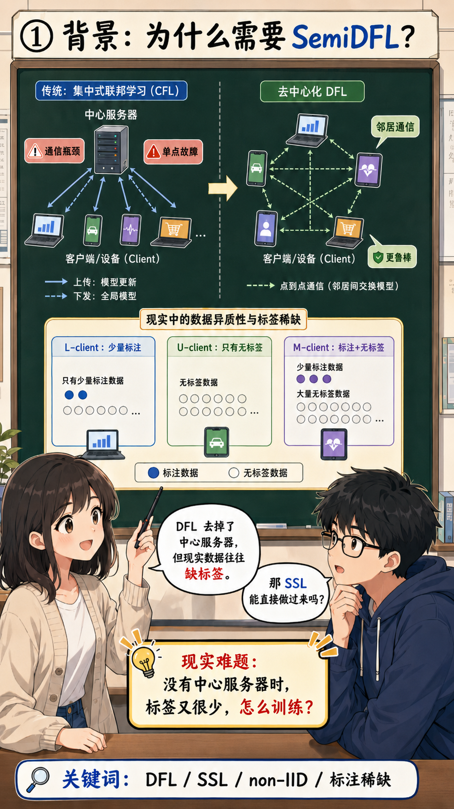 | 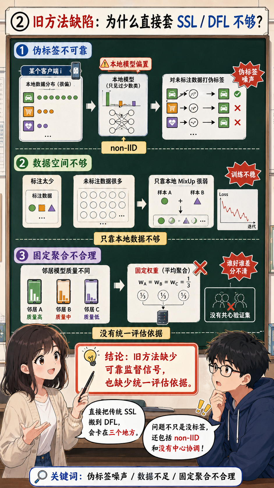 | 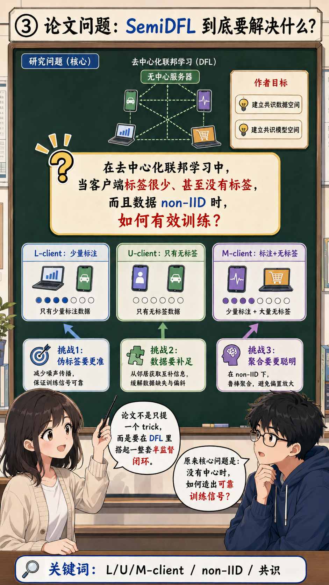 | 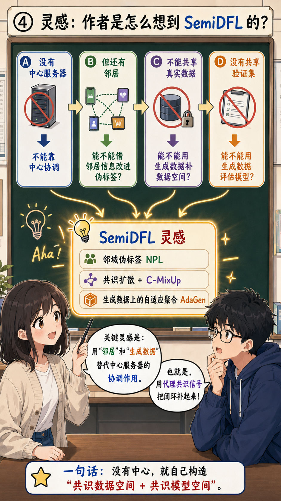 |

| S5 | S6 | S7 | S8 |
| --- | --- | --- | --- |
| 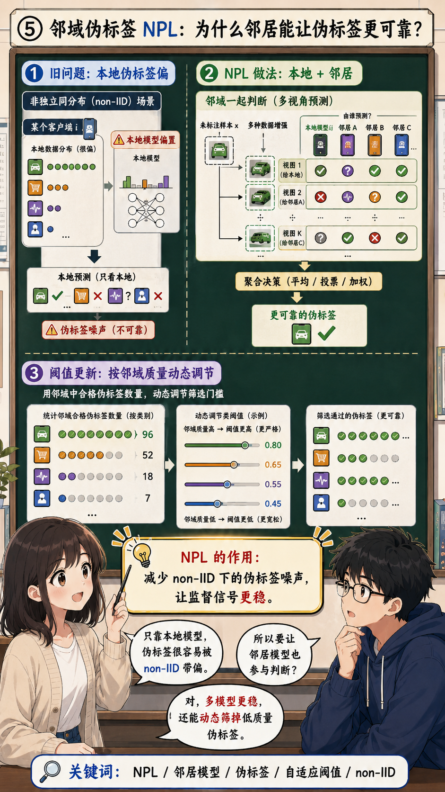 | 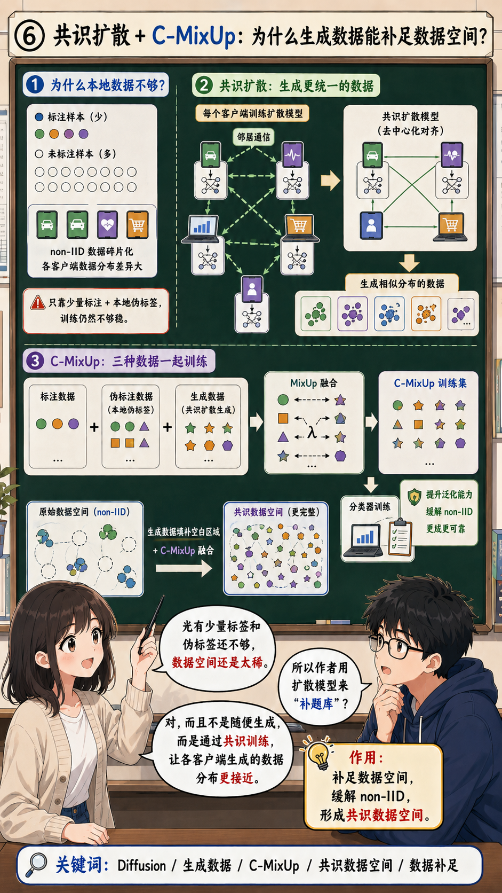 | 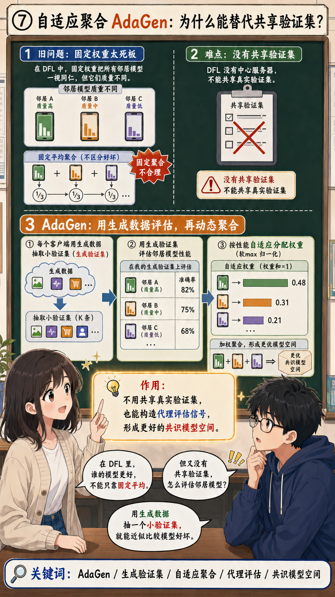 | 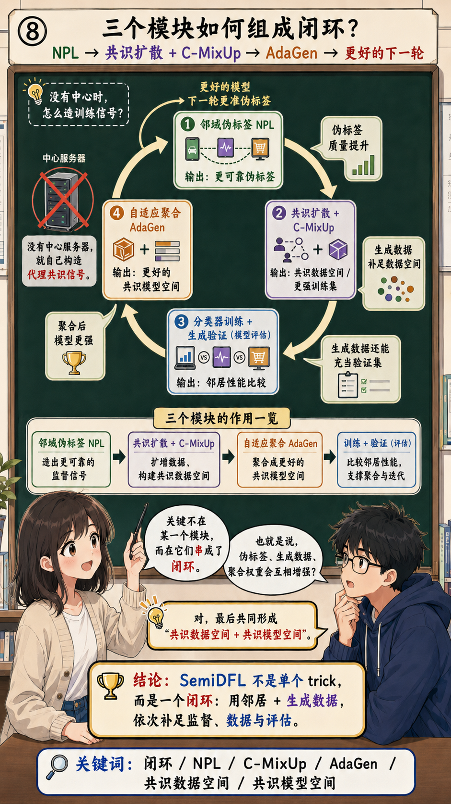 |

| S9 | S10 | S11 | S12 |
| --- | --- | --- | --- |
| 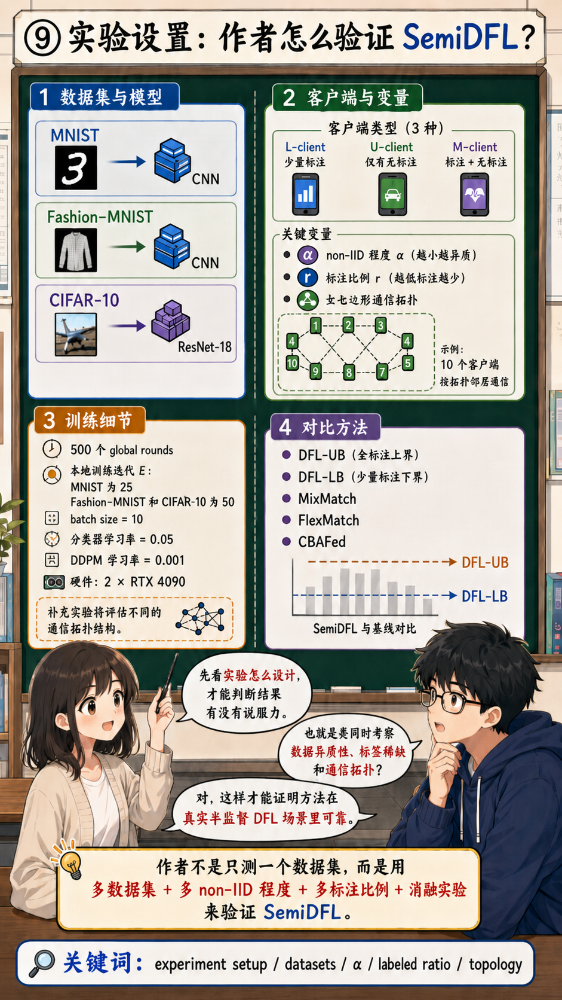 | 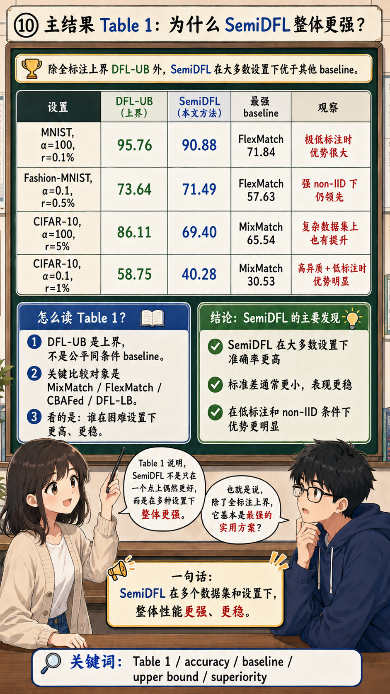 | 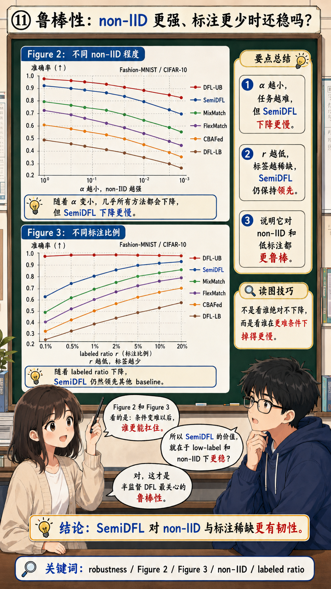 | 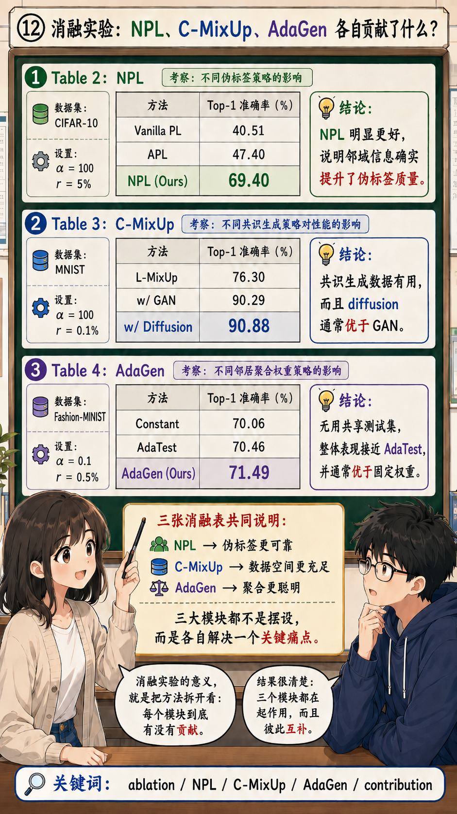 |

## 关键规则

- **严格分阶段**：报告、卡通图、PDF 合成是三个阶段。即使用户一次性要求全部完成，也必须停在下一个阶段等待确认。
- **文字和生图分开**：生成精读报告、提示词、检查清单、状态说明时，不同时直接生成图片。
- **必须是多张连续漫画**：默认输出是多张独立卡通页组成的连续漫画，不是一张 SVG、长图、海报或合并拼图。
- **ChatGPT 网页版用 Create image**：在 ChatGPT 网页版 / App 中，直接生卡通图时必须使用 Create image。
- **Codex 优先 imagegen**：在 Codex / coding-agent 中，优先使用 `imagegen` skill；不可用时再用 ChatGPT Images 2.0 API 或其他用户批准的生图 API。
- **禁止 SVG 替代卡通图**：不能用 SVG、Mermaid、HTML/CSS、canvas 或手绘矢量图替代卡通漫画页。
- **小批量生成**：每次通常生成 2-4 张图；复杂章节分多次继续，保持角色、风格、语言、运镜和符号一致。
- **一页一个教学点**：每张卡通页只讲一个核心点，避免把多个公式、模块、表格和结论挤到同一页。
- **证据防幻觉**：生图前检查原论文和精读报告；论文没写的硬件、耗时、超参、数据划分等必须标为“未报告”，不能编造。
- **PDF 最后再合成**：只有当所有 raster 卡通图已生成并得到用户确认后，才执行最终 PDF 合成。

## 示例文件

仓库保留了一个 SemiDFL 示例，用来对照 ChatGPT 网页版中的完整交互流程和最终产物：

- `example/S1.png` 到 `example/S12.png`：12 张由 skill 生成的精读报告卡通图，用来展示论文背景、方法、实验、局限和总结等内容如何被拆成连续漫画页。
- [`example/semiDFL.pdf`](example/semiDFL.pdf)：示例中使用的原始论文 PDF，方便用户直接上传到 ChatGPT Project 或放入 Codex 工程目录进行测试。
- [`example/SemiDFL精读卡通图报告.mhtml`](example/SemiDFL%E7%B2%BE%E8%AF%BB%E5%8D%A1%E9%80%9A%E5%9B%BE%E6%8A%A5%E5%91%8A.mhtml)：ChatGPT 网页版对话导出示例，展示从配置 skill、生成精读报告、分批生成卡通图到准备 PDF 的真实交互过程。
- [`example/semiDFL_codex_v.mp4`](example/semiDFL_codex_v.mp4)：Codex 下运行该 skill 的部分片段，用来参考本地 codex 环境中的执行方式。

当前版本默认使用 9:16 手机竖屏，用户也可以切换为 16:9、4:5、1:1、3:4 或自定义比例。

## 工作流

| 阶段 | 产出 |
| --- | --- |
| Step 0 | 完整文字精读报告、教学讲解准备、当前状态、下一步建议 |
| Step 1 | 背景、旧方法缺陷、论文问题、灵感来源 |
| Step 2 | 算法整体流程、模块输入输出、符号、维度、训练和推理 |
| Step 3 | 数据集、指标、baseline、主要结果、消融、例外和复现风险 |
| Step 4 | 局限性、审稿质疑、答辩口径和防御性解释 |
| Step 5 | 未来方向、隐藏假设和创新图谱 |
| Step 6 | 封面、总结页和 Q&A 备用页 |
| Step 7 | 把所有已确认卡通图和 Markdown 精读报告合成同一份 PDF，卡通页在前 |

## 推荐使用方式
如果token额度足够，推荐使用codex

ChatGPT 网页版 / App 和 Codex / coding-agent 的基本流程相同：先配置 skill 和论文文件，先做文字精读，再根据状态分批生成多张连续卡通图，最后在确认全部图片后合成 PDF。

如果目标是节省 token 和快速完成整套图文流程，通常优先使用 ChatGPT 网页版 / App。Codex 更适合本地文件整理、脚本执行、README 修改、skill 更新、zip 打包、PDF 合成和 GitHub 提交。

## ChatGPT 网页版 / App 使用步骤

1. 新建或打开一个 ChatGPT Project。
2. 先把 `paper-toon-deep-reader-v2.0.0.zip` 放入 Project 的 `Sources`。
3. 再把论文 PDF / LaTeX 放入 `Sources`，例如 `semiDFL.pdf`。
4. 发送首次使用提示词，让 ChatGPT 为当前会话配置并严格遵守这个 skill。
5. 首次执行只做文字精读和状态说明，不要直接生图或合成 PDF。
6. 当状态提示进入卡通阶段时，切换或使用 Create image，并明确要求“生成多张连续的卡通图”。
7. 每批图片确认后，再继续下一批；全部图片确认后，最后再要求合成 PDF。

首次使用提示词示例：

```text
请严格按照paper-toon-deep-reader-v2.0.0.zip里skill 的步骤对semiDFL.pdf进行分析
```


## Codex 使用步骤

Codex 环境也可以使用同一套流程。建议把 `paper-toon-deep-reader-v2.0.0.zip` 和论文文件放在同一个工程目录，或在 prompt 中写清楚文件路径。

Codex 首次使用提示词示例：

```text
请为一个 agent 配置 paper-toon-deep-reader-v2.0.0.zip 里的 skill，然后严格按照里面的步骤对 semiDFL.pdf 进行分析。
```

## 默认设置

- **画幅**：默认 `9:16` 手机竖屏；可改为 `16:9`、`4:5`、`1:1`、`3:4` 或自定义比例。
- **语言**：默认中文对白、旁白、标题和标签；可改为英文、中英双语或其他语言。
- **风格**：默认课堂板书漫画；也可选择扁平教育信息图、手绘白板草图、轻日漫科研课堂、柔和 3D 黏土/立体卡通等。
- **人物设定**：默认课堂场景，一个老师/讲解者加 2-3 个学生或研究者听众。
- **生成批次**：默认每次 2-4 张，复杂章节分多批继续。
- **页面结构**：推荐“页码/标题 -> 一句话问题或结论 -> 中心图式/场景 -> 2-5 个支撑卡片 -> 底部 takeaway/证据说明”。
- **构图模式**：默认单页主视觉命题，也可改为流程分镜、左右对比、答辩问答卡、极简概念卡或参考图引导。

## 交互状态

每次文本回复都应包含：

- 当前阶段和已产物。
- Runtime Environment。
- Image Generation Route。
- PDF Assembly Route。
- Storyboard Aspect Ratio。
- Storyboard Text Language。
- Storyboard Page Composition。
- 下一步用户可以怎么问。

这能避免长流程里 ChatGPT 或 coding-agent 重复状态、跳步、误用 SVG、一次性生成 PDF，或把文字报告和卡通图混在同一轮输出里。

## License

MIT-0
