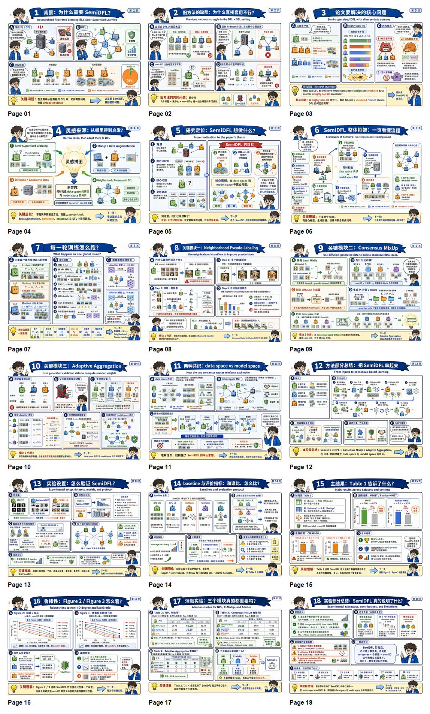
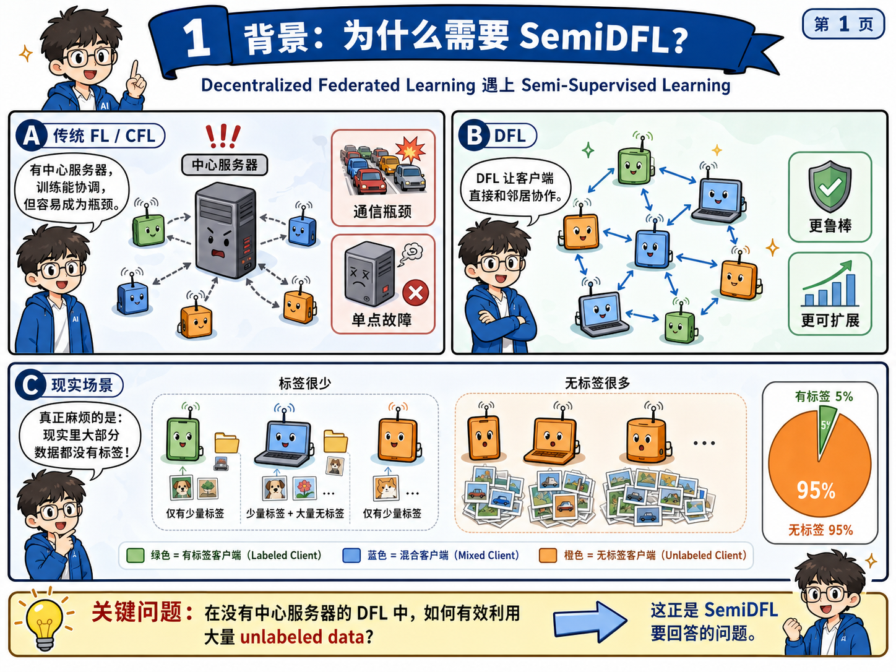
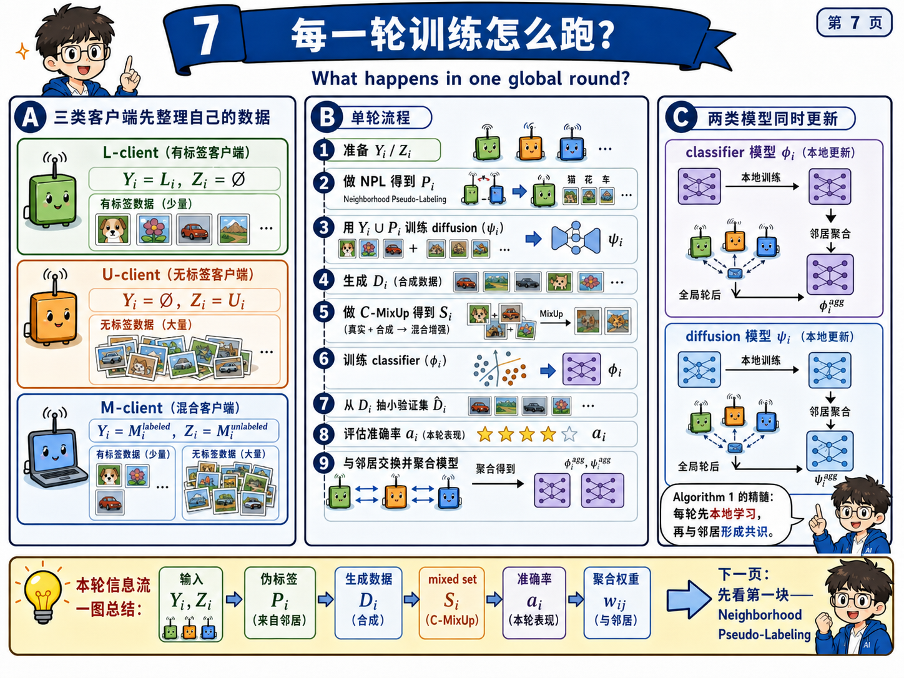
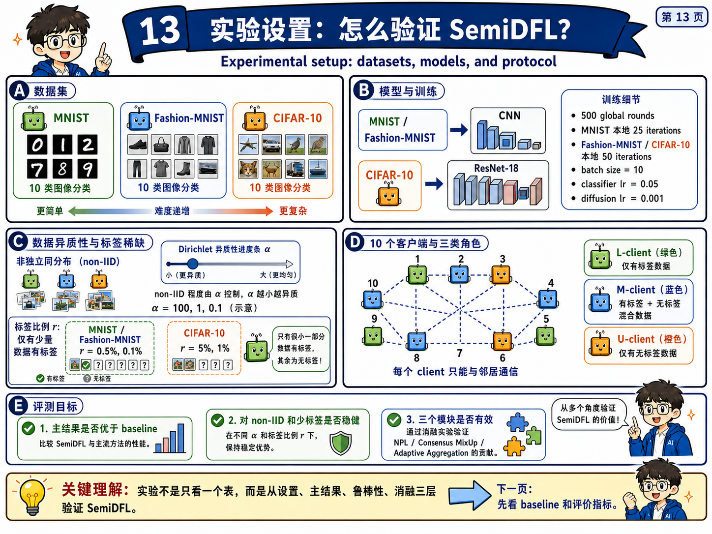
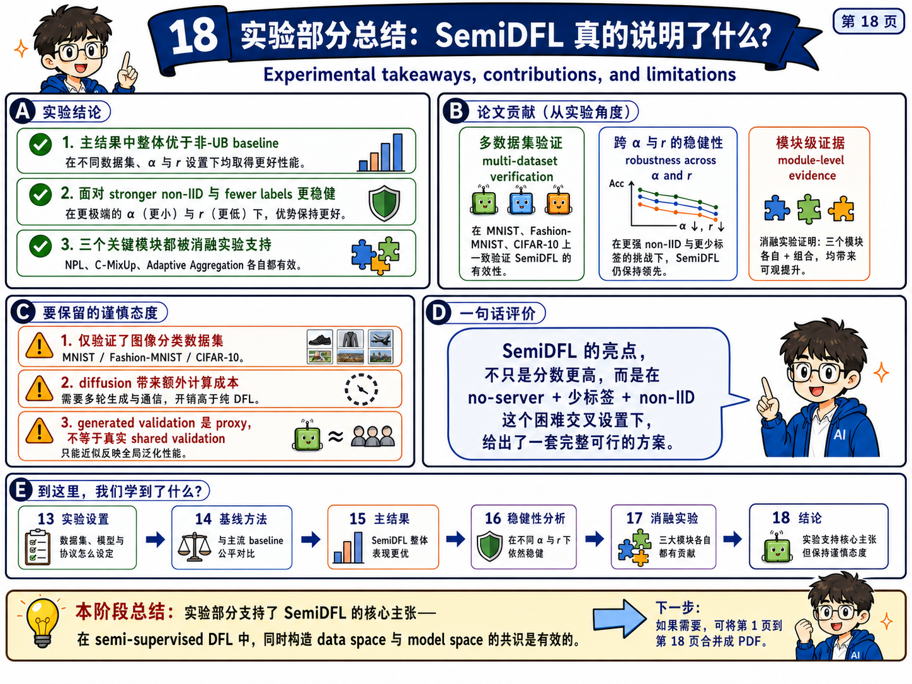
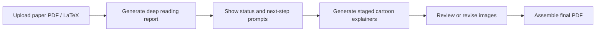

# Paper Deep Reading Teaching Explainer

A teaching-oriented paper reading skill that turns a research paper into a deep reading report, staged cartoon explainers, and a final shareable PDF.

This skill is designed for research seminars, paper discussions, reproduction prep, defense rehearsal, and classroom-style explanations. It first produces a rigorous paper-grounded report, then guides the user through staged cartoon-comic generation, and finally assembles the approved images into a PDF.

[中文 README](README.md)

## Recommended Setup: ChatGPT Web

**The recommended way to use this skill is inside a ChatGPT Web/App Project.** The core experience is: generate a deep reading report first, then create cartoon explainers stage by stage, then assemble the approved images into a PDF. The storyboard phase works best with ChatGPT's Create image capability.

Before uploading a paper, do this first: **add the skill to the ChatGPT Project `Sources` first, then upload the paper.** If you only upload a paper and ask for a summary, the model may behave like a generic paper summarizer instead of following the staged report, cartoon, and PDF workflow.

ClawHub skill page:

[https://clawhub.ai/c-narcissus/paper-deep-reading-teaching-explainer](https://clawhub.ai/c-narcissus/paper-deep-reading-teaching-explainer)

Recommended steps:

1. Open the ClawHub page above and download the skill zip.
2. Create or open a Project in ChatGPT Web/App.
3. Add this skill to the Project `Sources`. You can upload the skill zip, or upload the extracted `SKILL.md`, `README.md`, and related workflow/schema files.
4. After the skill is present in `Sources`, upload the paper PDF / LaTeX source.
5. Ask for the full text-only deep reading report first. Do not generate images in the first step.
6. Follow the skill's next-step prompts to generate cartoon pages stage by stage, then assemble the final PDF.

OpenClaw / ClawHub CLI users can also install it with:

```bash
openclaw skills install paper-deep-reading-teaching-explainer
```

If you use the skill in Codex, Claude Code, or another coding-agent environment, prefer the `imagegen` skill for cartoon image generation. Fall back to ChatGPT Images 2.0 API or another user-approved image-generation API only when `imagegen` is unavailable or insufficient.

## Demo

The example below comes from a complete `SemiDFL` run: a deep reading report first, then 18 staged cartoon explainer pages, then one combined PDF.



<p>
  
  
</p>
<p>
  
  
</p>

- Example PDF: [SemiDFL_cartoon_explainer_pages_1-18.pdf](example/SemiDFL_cartoon_explainer_pages_1-18.pdf)
- Exported ChatGPT project example: [SemiDFL deep reading report .mhtml](example/SemiDFL%20deep%20reading%20report%20.mhtml)
- Skill package: [paper-deep-reading-teaching-explainer-v10.1.2-clawhub.zip](paper-deep-reading-teaching-explainer-v10.1.2-clawhub.zip)

## What It Does

The skill creates three layers of output:

1. **Deep reading report**: motivation, problem setting, assumptions, method structure, experiment logic, limitations, and research idea opportunities.
2. **Teaching explainer package**: 30-second, 3-minute, and 10-minute summaries, plus scripts for formulas, figures, tables, experiments, misconceptions, and defense Q&A.
3. **Cartoon storyboard + PDF**: after the report is complete, it generates staged cartoon-comic pages for the background, method, experiments, limitations, future directions, and final presentation package, then assembles the approved images into one PDF.

## Workflow



Default stages:

| Stage | Output |
| --- | --- |
| Step 0 | Complete text report, teaching prep, current status, next-step prompts |
| Step 1 | Background, old-method defects, paper problem, inspiration |
| Step 2 | Algorithm overview and module-by-module explanation |
| Step 3 | Experiments, metrics, results, ablations, robustness |
| Step 4 | Limitations, reviewer defense, and Q&A visuals |
| Step 5 | Future directions and innovation graph |
| Step 6 | Cover, summary, and backup Q&A pages |
| Step 7 | Final PDF assembly from approved images |

## User Experience Highlights

- **Understand first, draw later**: the first run creates the full report before image generation starts.
- **Staged visual generation**: one visual stage at a time, so users can review, revise, and keep control.
- **Built-in next-step guidance**: each stage can tell the user what to ask next and provide copy-ready prompts.
- **Session recovery friendly**: if context is lost, users can continue with prompts such as: `使用这个skill，根据状态，执行第2步：生成算法整体流程与各模块解释的连续卡通图。`
- **Guidance when users are unsure**: users can simply ask: `使用这个skill，根据状态，告知下一步应该问什么。`
- **Made for teaching and defense**: the skill prepares explanations, misconception guardrails, role-play discussion prompts, defense questions, and presentation structure.
- **Shareable final output**: the cartoon pages can be assembled into a PDF for seminars, classes, reading groups, or review material.

## Who It Is For

- Graduate students, researchers, and research engineers who need to explain papers clearly.
- Users preparing seminars, course presentations, paper reproduction reports, or defense materials.
- Teachers and presenters who want to turn dense algorithms and experiments into visual narratives.
- Researchers who want to extract future research ideas from papers.

## Quick Start

1. Download the skill from ClawHub, or use `paper-deep-reading-teaching-explainer-v10.1.2-clawhub.zip` from this repository.
2. Prefer ChatGPT Web/App Projects, and add the skill to Project `Sources` first.
3. Then upload a paper PDF, LaTeX source, or both.
4. Ask the skill to generate the full text-only deep reading report first.
5. Follow the suggested next prompts to generate cartoon pages stage by stage.
6. After approving all images, run the final PDF assembly step.

Example prompts:

```text
使用这个skill，精读这篇论文，先生成完整文字报告，不要生成图片。
```

```text
使用这个skill，根据状态，执行第1步：生成背景、旧方法缺陷、论文问题和灵感来源的连续卡通图。
```

```text
使用这个skill，根据状态，执行最后一步：把所有已经生成并确认的图合成一个PDF。
```

## Example Artifacts

The `example` folder includes one complete sample:

- 18 cartoon explainer images;
- the final PDF assembled from those images;
- an exported ChatGPT project mhtml showing the practical usage flow and final result.

The sample demonstrates the main value of this skill: it is not just an image prompt helper. It is a full paper-to-teaching-material workflow that connects deep reading, explanation planning, staged visualization, and final delivery.

## License

MIT-0
